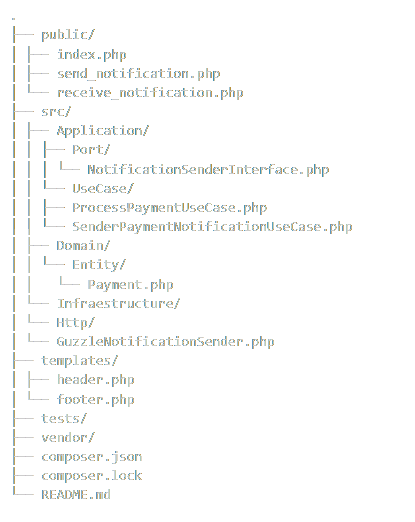
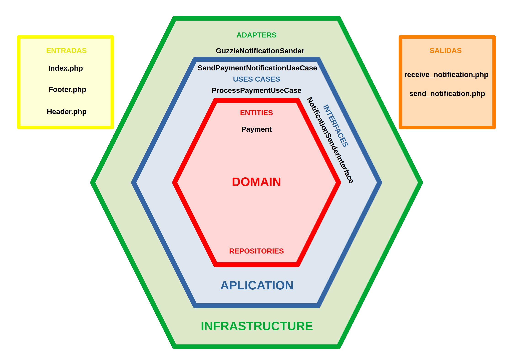

# Fonsipay - Sistema de Notificaciones de Pago en PHP (Arquitectura Hexagonal)

## 🧾 Descripción del proyecto

**Fonsipay** es un sistema de ejemplo diseñado para procesar pagos y enviar notificaciones HTTP POST firmadas mediante JWT. El objetivo principal es demostrar el uso de **arquitectura hexagonal (puertos y adaptadores)** en PHP, sin frameworks y utilizando buenas prácticas como separación de responsabilidades, inyección de dependencias y pruebas automatizadas.

## 🏗️ Arquitectura utilizada

Este proyecto implementa **arquitectura hexagonal**, dividiendo claramente las responsabilidades en:

- **Dominio**: Contiene la lógica de negocio.
- **Aplicación**: Orquesta casos de uso sin preocuparse de cómo se implementan.
- **Infraestructura**: Proporciona implementaciones concretas de interfaces.
- **Entradas/Salidas**: Archivos públicos (`send_notification.php`, `receive_notification.php`, `index.php`) que actúan como interfaces de usuario o de integración.

## 📂 Estructura del proyecto




## 🔄 Flujo del proceso de pago

1. **Usuario** accede a `index.php`, que muestra un formulario para introducir los datos del pago.
2. Al enviar el formulario, se hace POST a `send_notification.php`.
3. `send_notification.php`:
   - Crea un objeto `Payment`.
   - Usa `ProcessPaymentUseCase` para convertirlo en JSON y firmarlo con JWT.
   - Usa `SenderPaymentNotificationUseCase` para enviar el POST usando `GuzzleNotificationSender`.
4. **receive_notification.php**:
   - Verifica la cabecera `Signature` (JWT).
   - Compara el cuerpo JSON con el contenido del JWT.
   - Si coincide, procesa la notificación y muestra los datos recibidos.

---

## 🧱 Desglose por capas



### 🧠 Dominio (`src/Domain`)

- **Payment.php**  
  Entidad del dominio. Representa un pago con sus atributos y métodos:
  - `toArray()` → Devuelve el objeto como array asociativo.
  - `fromArray()` → Crea un objeto `Payment` desde un array.

### 🎯 Aplicación (`src/Application`)

- **ProcessPaymentUseCase.php**  
  Caso de uso que convierte el `Payment` en JSON y lo firma con JWT.

- **SenderPaymentNotificationUseCase.php**  
  Caso de uso que envía el JSON firmado mediante un puerto (`NotificationSenderInterface`).

- **NotificationSenderInterface.php**  
  Puerto de salida. Define una interfaz para cualquier sistema que pueda enviar notificaciones (HTTP, WebSocket, etc.).

### 🌐 Infraestructura (`src/Infraestructure`)

- **GuzzleNotificationSender.php**  
  Adaptador que implementa `NotificationSenderInterface` usando la librería Guzzle para hacer POST HTTP.

### 📥 Entradas y vistas (`public/` y `templates/`)

- **index.php**  
  Muestra un formulario HTML para introducir los datos del pago.

- **send_notification.php**  
  Controlador HTTP que recibe los datos del formulario, crea el pago, firma el JWT y lo envía a `receive_notification.php`.

- **receive_notification.php**  
  Controlador que actúa como receptor:
  - Verifica la firma JWT.
  - Cambia el estado del pago a `"Received"`.
  - Muestra los datos del pago.

- **header.php / footer.php**  
  Fragmentos HTML reutilizables que forman la interfaz básica del sistema.

---

## 🔧 Dependencias

Se instalan vía Composer:

- `firebase/php-jwt`: Para generar/verificar JWT.
- `guzzlehttp/guzzle`: Para enviar peticiones HTTP (usado en GuzzleNotificationSender).
- `ramsey/uuid`: Para generar identificadores únicos de notificación.

```bash
composer install
